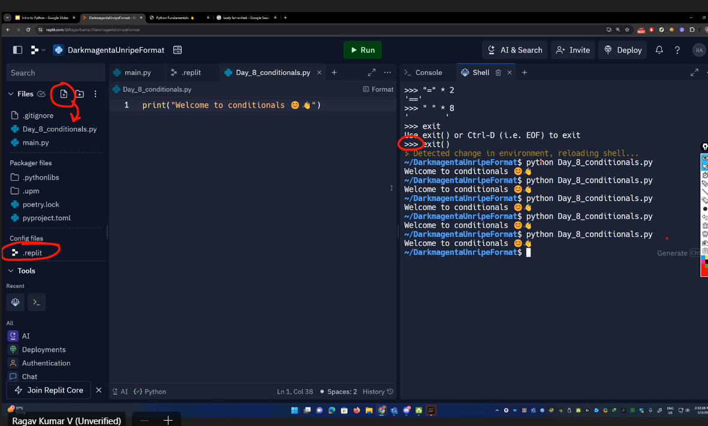

# Introduction to Python
- High Level ,interpreted ,general-purpose programming language
- Guido Van Rossum 
- first released in 1991
- emphasizes code readability with significant indentation
- some new languages-kotlin,rust,swift
- any kind of endpoints which gives data is called api
- flask
- application of python
- veratility and developer-friendly nature
- a large & active community
- continously
- use icons in resume
- Declaration
- Assignment
- datatype infered from value
```python
    name="John Doe"
    height=5.11
    is_adult=True
```
- interpolation
```python
print(f"hello,{name}!)
# Step 2: Adding another input

age = input("Enter your age: ")
print(f"Hello, {name}! You are {age} years old.")
```
- everything coming out of input is string, that is we need to type cast or use interpolation
- REPL
    - real - eval- print -loop
- "*" can be used as string method to repeat a number
- Rule Variable name
    1. cannot have special signs(@,!) except _
    2. cannot start with number
    3. cannot have keywords(print ,if ,for etc)

```python
    # Task -> Fahrenheit to Celcius | Get Fahrenheit from user

#Ouput
#The equivalent of 98.6°F is 37°C
fahrenheit=float(input("enter fahreneit = "))
print(str(fahrenheit)+"°F")
celsius=(fahrenheit-32)*5/9
print(str(celsius)+"°C")
```


- lexical compqarison
- code debt - tomorrow I will make better || tomorrow never comes
- 5 pillars Code Quality
    1. Readability
    2. Maintainability
    3. Extendibility
    4. Testability
    5. Performance

-Ternary-> 3 operands
- unary opereator->not,++,--
- statement vs expression
- membership function (in)

- strip,upper,lower,find,replace,title capitalize
- if value not there then find will return -1
- Strings are immutable.
- value of list can be changed
```python
    quote3="Dream is not something"
    quote3[0]='y' #error :Reason immutable
    quote3="cool"
```
- Slicing operator
```python
    quote="Dream"
    print(quote[1:3]) #output =>re 
    # will only include 1 & 2 index and will leave 3
```